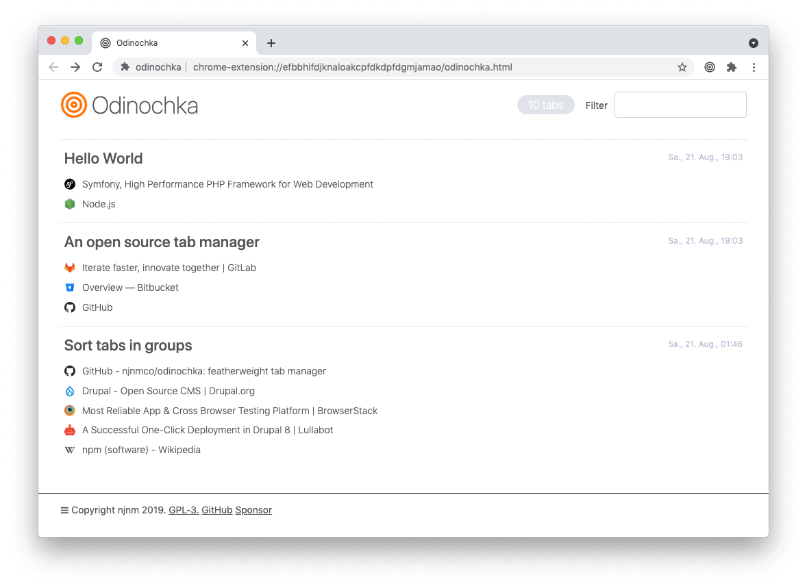

# Odinochka

## Fork

Forked from [njnmco/odinochka](https://github.com/njnmco/odinochka)

Thanks to njnmco for the great extension. Being another OneTab user looking for
a better alternative, I was glad finding this, and forked it to make some
additions, mostly layout and looks for now. Still a work in progress ;)



## OneTab

I was a heavy OneTab user.

I had 5k+ tabs before my "data loss incident", when GoToMeeting went berserk,
crashed chrome, and my tabs were gone...

Towards the end, it was:

- Slow
- GA tracking
  - who knows what they are doing with my tab data
- Requests 900 favicons on boot via Google proxy
  - This also breaks locally hosted apps favicons
- Not Great Suspender compatible
  - I've req'd this feature at least a few times over last 3 years.
- Not backed up anywhere
  - Export is manual and in a crap format.
  - When the tabs are gone, they are gone.

So I wrote my own.

## TODO

- [x] Save Tabs
  - [x] Browser action button
  - [x] context menu
  - [x] Keyboard shortcuts
  - [x] Save tabs to indexeddb
  - [x] except pinned tabs
- [x] UI page
  - [x] list tabs
    - [x] restore tab
      - [x] pop out youtube mini player
        - [x] resizing preserves aspect ratio
    - [x] delete tab
    - [x] favicons
    - [x] drag and drop
      - [x] within tab group
      - [x] between tab group
      - [x] merge tab groups
  - [x] tab groups
    - [x] Restore
    - [x] Rename
    - [x] Delete
    - [x] pop out
  - [x] Counter
  - [x] Options
    - [x] skip pinned tabs
    - [x] Autoremove links
    - [x] How to open Groups
    - [x] Filter Duplicates
    - [x] Import / Export
    - [x] disable favicons
  - [x] Filter box
  - [x] refresh in place
- [x] automated cloud backup

## Etymology

Russian for singleton, but also:

- Loner
- Alaskan trading posts
- solitary confinement

## Advanced Features

### Restoring from a history dump

You can use the below `jq` command to convert from an
[Export History extension](https://chrome.google.com/webstore/detail/export-historybookmarks-t/dcoegfodcnjofhjfbhegcgjgapeichlf)
dump format to a file that can be read back in to odinochka.

```
jq '[{ts:1, name:"restore", tabs:[.[] | {title:.title, url:.url, favicon:"", pinned:false}], urls:[.[].url]}]' history_export.json  >history2.json
```

Chrome can mysteriously delete data whenever it crashes, so I recommend
regularly backing up your tabs using the export features.

### Restoring from pinboard.in

1. Download all links as json at
   https://api.pinboard.in/v1/posts/all?format=json
2. Convert using
   `jq '[{ts:3, name:"pinboard", tabs:[ .[] | {title:.description, url:.href, favicon:"", pinned:false} ], urls:[.[].href] }]' downloads/pinbord.json >pinboard.out`
3. Import the converted json

### Automated cloud backup

To enable automated cloud backup, add the following to the "Advanced options":

```
{
"url": "https://MY.REST/ENDPOINT",
"method": "PUT",
"interval": 30,
"consent": "I know what I'm doing."
}
```

A timer (interval in minutes) will XHR the dumped tab database to the specified
URL.

To use Amazon AWS for storage:

- Create an S3 bucket
- Proxy the bucket using AWS API Gateway (see
  [tutorial](https://docs.aws.amazon.com/apigateway/latest/developerguide/integrating-api-with-aws-services-s3.html#api-items-in-folder-as-s3-objects-in-bucket))
- Enable
  [CORS](https://docs.aws.amazon.com/apigateway/latest/developerguide/how-to-cors.html#how-to-cors-console)
  on the Gateway
